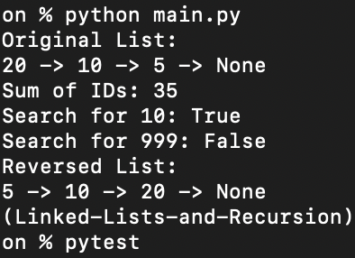
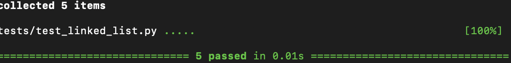

# Linked Lists and Recursion Lab

## Overview

This project demonstrates how to implement a **singly linked list** and perform common operations using **recursion**.

The linked list stores integer IDs and supports:

- Insertion
- Recursive sum
- Recursive search
- Recursive reverse

---

# Features

### Insert Nodes

Nodes can be inserted at the front or end of the list.

Example:

20 -> 10 -> 5 -> None

---

### Recursive Sum

Uses recursion to calculate the sum of all node values.

Example:

Sum of IDs: 35

---

### Recursive Search

Returns True if a value exists in the list.

Example:

Search for 10 → True  
Search for 999 → False

---

### Recursive Reverse

Reverses the list in place using recursion.

Example:

Original:

20 -> 10 -> 5 -> None

Reversed:

5 -> 10 -> 20 -> None

---

# Running the Program

Run:

python main.py

---

# Running Tests

Run:

pytest

---

# Screenshots

## Program Output

---

## Tests Passing

---

# File Structure

.
├── linked_list.py
├── main.py
├── tests
│ └── test_linked_list.py
├── README.md

---

# Concepts Learned

- Linked list data structures
- Recursion
- Node traversal
- In-place pointer reversal
